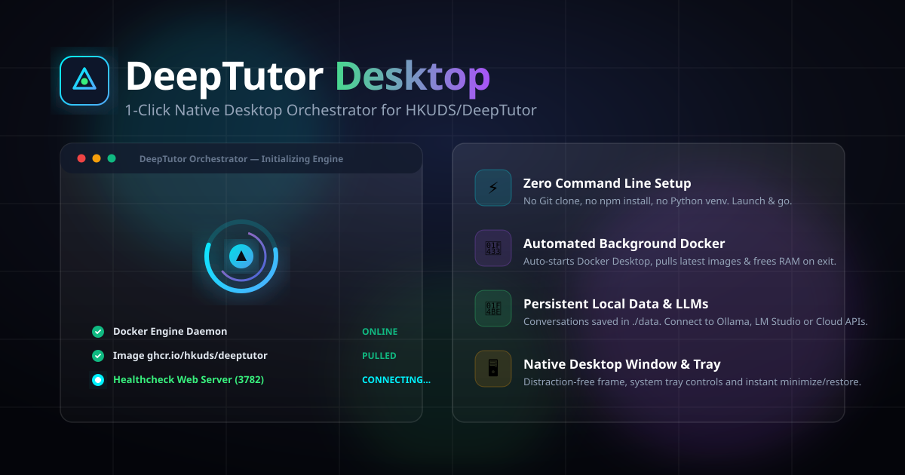
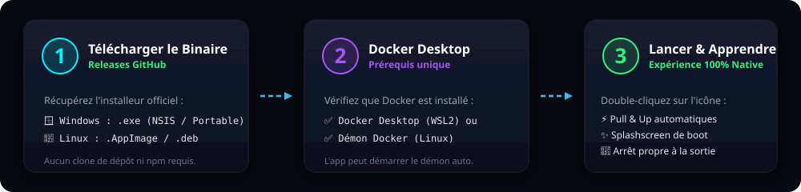
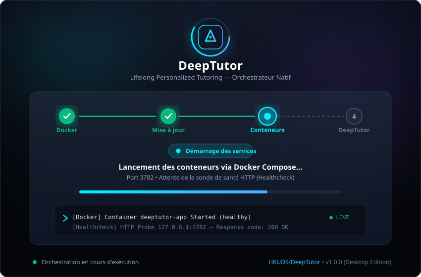

<div align="center">

  

  <br/><br/>

  [](https://github.com/mattmathbg/DeepTutor-Desktop/releases)
  [](https://github.com/mattmathbg/DeepTutor-Desktop/actions)
  [](https://github.com/mattmathbg/DeepTutor-Desktop/releases)
  [](https://www.docker.com/)
  [](LICENSE)
  [](https://github.com/HKUDS/DeepTutor)

  <br/>

  <h3>🎓 L'expérience de bureau autonome, native et sans configuration pour DeepTutor.</h3>
  <p><i>Transforme le tuteur IA conteneurisé officiel en une application de bureau fluide, avec démarrage en un clic et gestion automatique du cycle de vie Docker.</i></p>

  <p>
    <a href="https://github.com/mattmathbg/DeepTutor-Desktop/releases/latest"><b>📥 Télécharger la dernière version</b></a> •
    <a href="#-guide-dinstallation-en-3-étapes"><b>🚀 Installation Rapide</b></a> •
    <a href="#-compatibilité--architecture-officielle"><b>🛡️ Architecture & Compatibilité</b></a> •
    <a href="#-fonctionnalités-clés"><b>✨ Fonctionnalités</b></a>
  </p>

</div>

---

## ⚡ Guide d'Installation en 3 Étapes

Fini les lignes de commande complexes, les `git clone` ou les compilations `npm`/Python manuelles. Pour utiliser DeepTutor Desktop :

<div align="center">
  
</div>

<br/>

1. 📥 **Télécharger** l'installateur adapté à votre système dans les [**Releases GitHub**](https://github.com/mattmathbg/DeepTutor-Desktop/releases/latest) :
   - **Windows** : `DeepTutor Setup 1.0.0.exe` (Installeur NSIS) ou `DeepTutor 1.0.0.exe` (Portable).
   - **Linux** : `DeepTutor-1.0.0.AppImage` (Universel) ou `deeptutor-desktop_1.0.0_amd64.deb` (Debian / Ubuntu).
2. 🐳 **S'assurer que Docker Desktop est installé** (ou le démon Docker sous Linux avec WSL2 activé sur Windows).
3. 🚀 **Lancer l'application** : DeepTutor Desktop s'occupe de tout en tâche de fond (vérification du démon, téléchargement des conteneurs officiels, healthcheck HTTP et redirection native).

---

## 🛡️ Compatibilité & Architecture Officielle

> [!IMPORTANT]
> **DeepTutor Desktop** est un wrapper et orchestrateur natif de bureau qui s'appuie directement sur les images officielles publiées par le laboratoire de recherche **[HKUDS/DeepTutor](https://github.com/HKUDS/DeepTutor)** (`ghcr.io/hkuds/deeptutor:latest`).

### Comment ça fonctionne ?
```
┌────────────────────────────────────────────────────────┐
│               DeepTutor Desktop (Electron)             │
│  - Splashscreen Cyberpunk avec suivi d'étapes en direct │
│  - Redirection automatique sur http://127.0.0.1:3782   │
│  - Gestion System Tray & Arrêt propre (libération RAM) │
└──────────────────────────┬─────────────────────────────┘
                           │ Orchestration IPC
┌──────────────────────────▼─────────────────────────────┐
│                 Moteur Docker d'Arrière-plan            │
│  - Détection & Démarrage automatique de Docker Desktop │
│  - Pull automatique des dernières images officielles   │
│  - Montage de volume persistant (./data -> /app/data)  │
└──────────────────────────┬─────────────────────────────┘
                           │
┌──────────────────────────▼─────────────────────────────┐
│          Image Officielle HKUDS/DeepTutor (Docker)      │
│  - Backend FastAPI (Port 8001)                         │
│  - Frontend Next.js / Web UI (Port 3782)               │
│  - Support LLMs Locaux (Ollama) & Clés API Cloud      │
└────────────────────────────────────────────────────────┘
```

- **100% de parité fonctionnelle** : Vous bénéficiez de toutes les fonctionnalités de DeepTutor (tutorat personnalisé, indexation de manuels PDF, graphes de concepts, quiz interactifs, arborescence pédagogique).
- **Mises à jour transparentes** : L'orchestrateur vérifie et synchronise l'image `ghcr.io/hkuds/deeptutor` à chaque démarrage sans écraser vos données locales.
- **Cycle de vie propre** : Dès que vous fermez la fenêtre, l'application exécute un `docker compose stop` propre pour libérer immédiatement votre processeur, mémoire vive et GPU.

---

## 🎨 Démo Visuelle du Splashscreen

L'application intègre un écran de démarrage haute fidélité avec design glassmorphism, anneau de pulsation réactif, barre de progression et console d'orchestration Docker intégrée :

<div align="center">
  
</div>

---

## 🌟 Fonctionnalités Clés

- 🔄 **Orchestration Docker Automatisée (Boîte Noire)** :
  - **Vérification préliminaire** : Teste la présence et l'activité du démon Docker (`docker info`). Si Docker Desktop n'est pas lancé, le démarre automatiquement sous Windows.
  - **Mise à jour transparente** : Récupère la dernière version officielle (`ghcr.io/hkuds/deeptutor:latest`) via `docker compose pull`. En mode hors-ligne, bascule instantanément sur l'image locale existante.
  - **Démarrage détaché** : Lance les services via `docker compose up -d` sans encombrer votre terminal.
  - **Arrêt propre garanti** : Intercepte la fermeture de la fenêtre (`before-quit` / `close`) pour exécuter automatiquement `docker compose stop`, libérant instantanément la RAM et les accélérateurs GPU.

- 🎨 **Expérience Utilisateur & Splashscreen Cyberpunk** :
  - Design sombre haute fidélité (effets glassmorphism, lueurs néon cyan/violettes, indicateur d'étapes en direct).
  - Console de journalisation intégrée et rétractable affichant la sortie standard et d'erreur Docker en direct.
  - Écran d'assistance avec bouton *Réessayer* et diagnostics rapides en cas d'erreur Docker/WSL2.

- 🔍 **Healthcheck HTTP & Redirection Fluide** :
  - Sonde HTTP continue sur le port applicatif local (`http://127.0.0.1:3782`).
  - Redirection automatique et instantanée de la vue native dès que le serveur web et le backend sont opérationnels.

- 💾 **Persistance des Données & Support LLMs** :
  - Montage de volume persistant (`./data` mappé sur `/app/data`) : conservation des cours, conversations, documents et modèles configurés.
  - Résolution automatique de `host.docker.internal` pour connecter vos modèles locaux (Ollama, LM Studio, vLLM).
  - Gestion des clés d'API (OpenAI, Gemini, DeepSeek, Anthropic, Mistral, Groq, etc.) via fichier `.env` ou directement dans l'interface utilisateur.

- 🖥️ **Intégration Système OS** :
  - Fenêtre épurée et immersive sans barre d'adresses de navigateur.
  - Intégration System Tray (barre des tâches) avec menu contextuel d'ouverture, de redémarrage et d'arrêt complet des services.

---

## ⚙️ Configuration des Modèles LLM

Au premier lancement, un fichier `.env` est automatiquement généré à la racine de l'application (ou à côté de l'exécutable portable). Vous pouvez y configurer vos clés API :

```env
# Clés d'API pour les modèles distants (Optionnel)
OPENAI_API_KEY=sk-...
DEEPSEEK_API_KEY=sk-...
GEMINI_API_KEY=AIza...
ANTHROPIC_API_KEY=sk-ant-...
GROQ_API_KEY=gsk_...

# Port personnalisé de l'application (Par défaut: 3782)
DEEPTUTOR_PORT=3782
```

> 💡 **Astuce** : Vous pouvez également configurer ou modifier vos clés API et modèles à tout moment directement depuis l'interface DeepTutor dans **Settings → Models**, ou connecter vos modèles locaux via **Ollama** (`http://host.docker.internal:11434/v1`).

---

## 📁 Structure du Projet

```
DeepTutor-Desktop/
├── .github/
│   └── workflows/
│       └── release.yml         # CI/CD de build & publication automatique des releases
├── assets/
│   ├── hero-banner.svg         # Bannière principale haute résolution
│   ├── workflow.svg            # Schéma du parcours d'installation en 3 étapes
│   └── splashscreen-showcase.svg # Mockup graphique du splashscreen
├── docker-compose.yml          # Définition des services Docker officiels
├── .env.example                # Modèle de variables d'environnement
├── package.json                # Configuration Electron & Electron-Builder
├── data/                       # Volume de persistance local monté dans /app/data
├── scripts/
│   └── generate_icon.js        # Générateur d'icônes multi-formats
└── src/
    ├── main/
    │   ├── index.js            # Processus principal Electron & cycle de vie
    │   ├── docker.js           # Orchestrateur Docker (info, auto-start, pull, up, stop)
    │   ├── healthcheck.js      # Sonde HTTP résiliente (port 3782)
    │   ├── tray.js             # Intégration barre des tâches (System Tray)
    │   └── config.js           # Résolution dynamique des chemins et des ports
    ├── preload/
    │   └── preload.js          # Pont contextBridge sécurisé
    └── renderer/
        ├── splash.html         # Écran de chargement graphique
        ├── splash.css          # Thème sombre haute fidélité
        ├── splash.js           # Contrôleur frontend & écoute IPC
        └── assets/             # Icônes et logos vectoriels
```

---

## 🛠️ Développement & Compilation Locale

Si vous souhaitez contribuer ou compiler l'application vous-même :

### 1. Cloner et installer les dépendances
```bash
git clone https://github.com/mattmathbg/DeepTutor-Desktop.git
cd DeepTutor-Desktop
npm install
```

### 2. Démarrer en mode développement
```bash
npm run dev
```

### 3. Empaqueter les exécutables localement

- **Pour Windows** (`.exe` NSIS & Portable) :
  ```bash
  npm run package:win
  ```
- **Pour Linux** (`.AppImage` & `.deb`) :
  ```bash
  npm run package:linux
  ```
Les binaires générés seront placés dans le répertoire `release/`.

---

## 🤝 Contribution & Remerciements

Les contributions, signalements de bugs et suggestions sont les bienvenus ! N'hésitez pas à ouvrir une *Issue* ou à soumettre une *Pull Request*.

- DeepTutor Original Core : **[HKUDS/DeepTutor](https://github.com/HKUDS/DeepTutor)**
- Wrapper Desktop & Orchestration : **[mattmathbg](https://github.com/mattmathbg)**

---

## 📄 Licence

Ce projet est distribué sous la licence [Apache 2.0](LICENSE).
